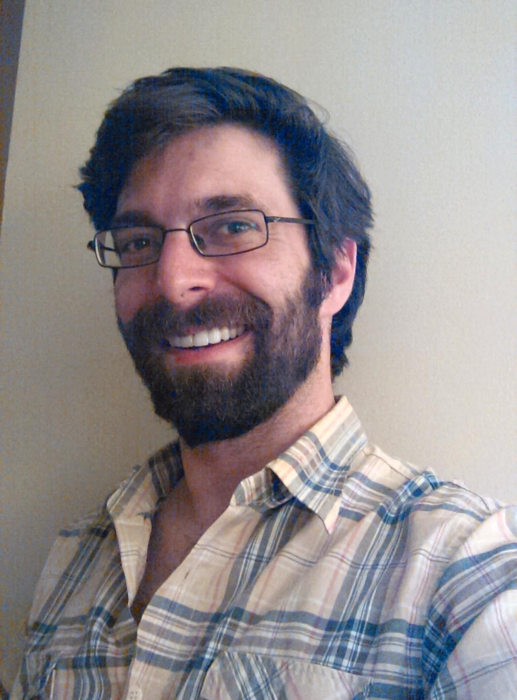

<header id="masthead">
  
  

    <h1>Sebastian Benthall</h1>
    <ul id="affiliations">
      <li>Research Director, <a href="https://www.law.nyu.edu/centers/ili">Information Law Institute</a>, New York University School of Law</li>
      <li>Research Scientist, International Computer Science Institute</li>
      <li>External Faculty, New York University <a href="https://publichealth.nyu.edu/research-scholarship/centers-labs-initiatives/agent-based-modeling-lab">Agent Based Modeling Lab</a></li>
      <!--<li>Research Engineer, <a href="https://econ-ark.org/">Econ-Ark</a></li>-->
    </ul>
  

</header>

I study how software, markets, and law shape one another. I build open source tools for modeling those dynamics. My current work asks what it takes for AI to be trustworthy, safe, and good in the long run.

<h2 id="projects"><a href="#projects">&sect;</a>Current Projects</h2>

<ul>
  <li>Building <a href="https://scikit-agent.org">scikit-agent</a>, a library for causal economic world modeling. It combines causal game theory with deep learning econometrics, and applies to AI and regulatory design.</li>
  <li>Designing fiduciary AI: turning the legal duties of trusted roles into design requirements for AI systems, and finding organizations that can standardize them. Supported by the Future of Life Foundation.</li>
  <li>Organizing visioning activities to develop new computational foundations for reasoning about <em>sociotechnical ecosystems</em>. Supported by <a href="https://www.nsf.gov/awardsearch/showAward?AWD_ID=2437745&amp;HistoricalAwards=false">NSF #2437745</a>.</li>
</ul>

<h2 id="publications"><a href="#publications">&sect;</a>Publications</h2>

<h3>Research Articles</h3>



<h3>Popular Writing and Trade Literature</h3>



<h3>Technical Reports and Pre-prints</h3>


    
<h2 id="software"><a href="#software">&sect;</a>Software</h2>
<ul>
  <li><a href="http://github.com/scikit-agent/scikit-agent">scikit-agent</a>, a system for causal economic world modeling. Like scikit-learn, but for agent-based modeling and computational economics.</li>
  <li><a href="http://github.com/sbenthall/bigbang">BigBang</a>, for the analysis of standards-setting, infrastructure governance, and open collaborative communities. This analytics engine serves as the back-end for Article 19's <a href="https://www.article19.org/resources/internet-standards-almanac-whos-really-shaping-the-internet/"><em>Guess Who!</em></a> tool, part of their Internet Standards Almanac.</li>
  <li><a href="https://github.com/sbenthall/SHARKFin">SHARKFin</a>, for modeling the interaction between the macroeconomy and the financial system.</li>
  <li><a href="https://github.com/econ-ark">Econ-Ark</a>, for structural economic modeling with heterogeneous agents.</li>
  <li><a href="http://geonode.org/">GeoNode</a>, an open source geospatial data management system. It was part of an <a href="https://opendri.org/wp-content/uploads/2017/03/OpenDRI-and-GeoNode-a-Case-Study-on-Institutional-Investments-in-Open-Source.pdf">innovative strategy</a> to leverage open source development practices for international development. There is still a great team working on it and deploying it as a product.</li>
</ul>

<h2 id="dissertation"><a href="#dissertation">&sect;</a>Dissertation</h2>

Sebastian Benthall. <em>Context, Causality, and Information Flow: Implications for Privacy Engineering, Security, and Data Economics</em>. Ph.D. dissertation. Advisors: John Chuang and Deirdre Mulligan. University of California, Berkeley. 2018. (<a href="https://escholarship.org/uc/item/5sg7q32q">eScholarship</a>) (<a href="https://www.slideshare.net/SebastianBenthall/context-causality-and-information-flow-implications-for-privacy-engineering-security-and-data-economics">slideshare</a>)

<h2 id="awards"><a href="#awards">&sect;</a>Prior Grants, Awards, and Support</h2>
<ul>
  <li><a href="https://www.nsf.gov/awardsearch/showAward?AWD_ID=2131532">NSF CCF-2131532</a> and <a href="https://www.nsf.gov/awardsearch/showAward?AWD_ID=2131533">CCF-2131533</a>, "Collaborative Research: DASS: Agent Based Modeling at the Boundary of Law and Software". Creating methods for using Agent-Based Modeling to hold software accountable to legal regulation. A collaboration between ICSI, the NYU School of Law, and the <a href="https://publichealth.nyu.edu/research-scholarship/centers-labs-initiatives/agent-based-modeling-lab">Agent-Based Modeling Lab at NYU School of Global Public Health</a>.</li>
  <li><a href="https://www.nsf.gov/awardsearch/show-award?AWD_ID=2105301">NSF SBE-2105301</a>, "Heterogeneous agent modeling of the personal data economy". A postdoctoral research fellowship focusing on computational economics methods for information law and privacy research.</li>
</ul>

<!--
<h2>Background</h2>

2021 - NSF SBE Postdoctoral Research Fellow

2019 - Research Engineer, Econ-Ark

2018 - : Research Scholar at NYU. <a href="https://www.guariniglobal.org/">GGLT</a> (2019 - ), <a href="http://www.law.nyu.edu/centers/ili">ILI</a> (2018 - ) and <a href="http://cyber.nyu.edu/">CCS</a> (2018 - 2019).

 
2016 - 2018 : Researcher at Cornell Tech under Prof. Helen Nissenbaum.

 
2016 - 2019 : Data scientist at Ion Channel.

 
2011 - 2018 : PhD at UC Berkeley's School of Information.

 
2007 - 2011 : Worked in programming, management, and marketing in geospatial civic tech company, OpenGeo.

 
2007 : B.A., Brown University, Cognitive Science.

 -->

<h2 id="web"><a href="#web">&sect;</a>On the Web</h2>

<a href="https://github.com/sbenthall">github</a> <a href="https://scholar.google.com/citations?user=iOgZOWYAAAAJ&amp;hl=en">google scholar</a> <a href="http://digifesto.com">blog</a> <a href="https://www.linkedin.com/in/sebastianbenthall/">linkedin</a> <!-- <a href="https://medium.com/@sbenthall">medium</a> -->

<h2 id="contact"><a href="#contact">&sect;</a>Contact</h2>

e-mail: spb413 at nyu dot edu

    